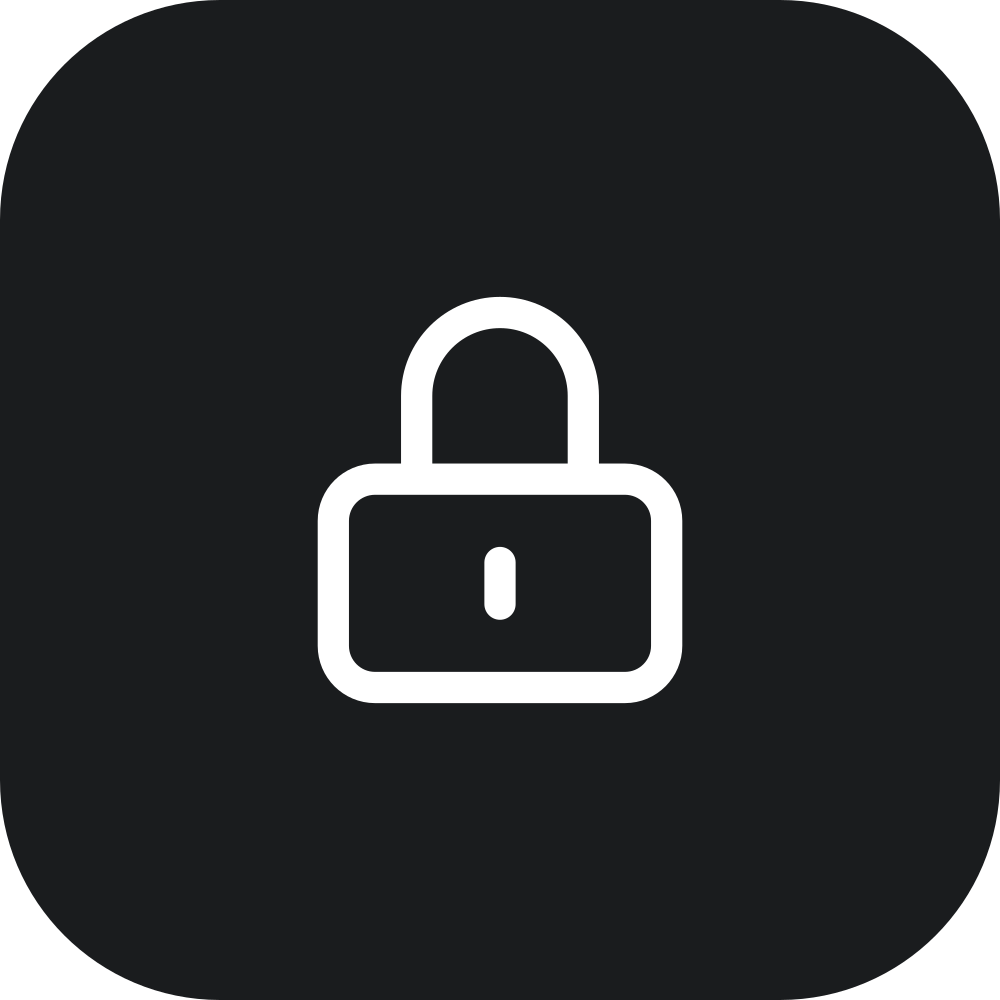

<div align="center">
  
  <h1 align="center">LibreLock Web</h1>
</div>

Web application for LibreLock, a secure, self-hosted password manager. Built with [Vue](https://vuejs.org/) and [Vite](https://vitejs.dev/).

> **Just want to run LibreLock?** One command brings up the whole stack - see [Get Started](https://github.com/LibreLock/) and the [self-hosting guide](https://github.com/LibreLock/.github/blob/main/docs/self-hosting.md).

## Development

Requires Node.js 22+ and an API to talk to ([librelock-server](https://github.com/LibreLock/librelock-server), `go run .`).

```bash
npm install
npm run dev
```

The dev server listens on [localhost:1401](http://localhost:1401) and proxies `/api` to `http://localhost:8000`, so the app and the API share one origin - no CORS, and the session cookie behaves as it does in production.

| Env var | Default | Effect |
| --- | --- | --- |
| `WEB_PORT` | `1401` | Port the dev/preview server listens on |
| `API_UPSTREAM` | `http://localhost:8000` | API the dev/preview server proxies `/api` to |

## Production build

```bash
npm run build     # static files in dist/
npm run preview   # serves dist/ with the same /api proxy
```

The Docker image serves `dist/` with nginx, listening on `$WEB_PORT` (default `1401`) and proxying `/api` to `$API_UPSTREAM` (default `http://api:8000`) - see [`nginx.conf.template`](nginx.conf.template). To build and run it against an API on the Docker host:

```bash
docker compose up -d --build
```

The app calls the API at `/api` on its own origin. Only if you serve the API from a different origin, build with `--build-arg VITE_API_BASE_URL=https://api.example.com` - and widen `connect-src` in the CSP accordingly.

## Contributing

See [CONTRIBUTING.md](CONTRIBUTING.md) for project structure, code style, and security guidelines.
